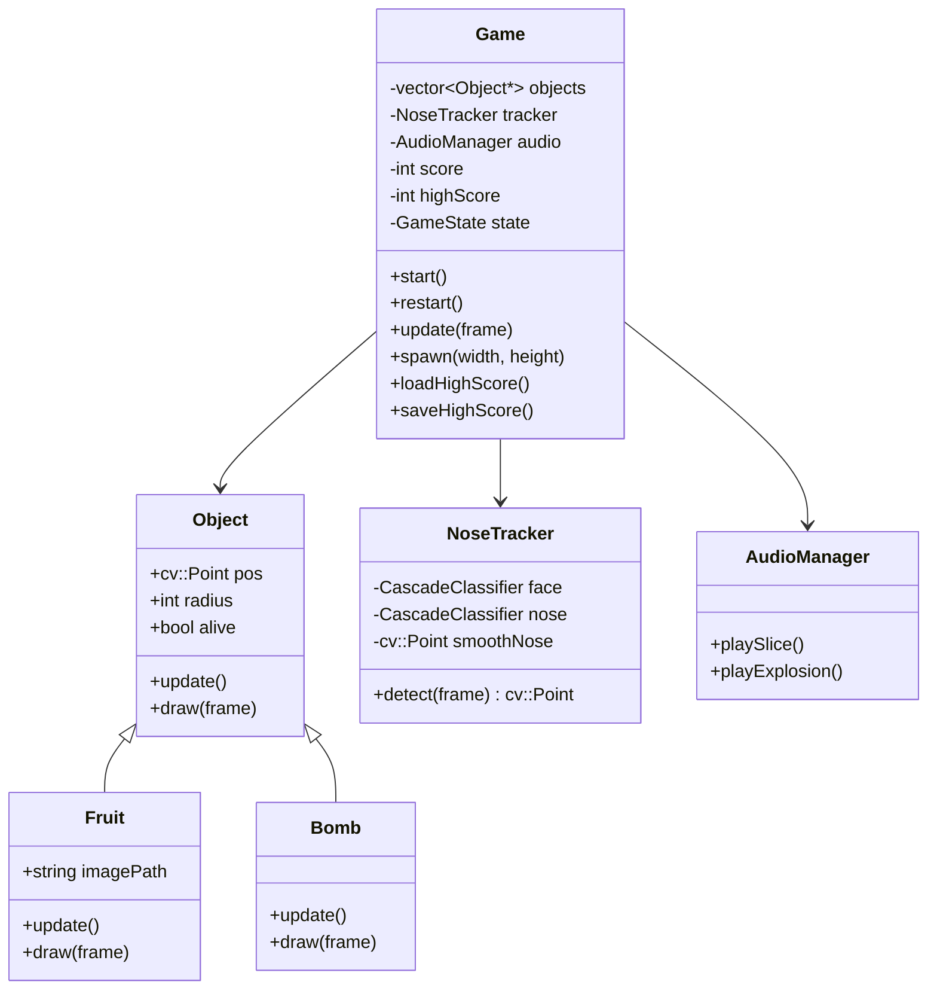

<h1 align="center">
  🍉 Fruit Nose
</h1>

<p align="center">
  
</p>

<p align="center">
  A real-time Fruit Ninja-inspired game controlled entirely by your nose using computer vision.
</p>

<p align="center">
  
  
  
  
</p>

---

## 🎮 About

**Fruit Nose** is a fun and innovative game that uses your **webcam** to track the position of your nose in real time. Instead of touching the screen or using a mouse, you physically move your head to slice fruits and dodge bombs — just like Fruit Ninja, but hands-free!

The game uses **Haar Cascade classifiers** from OpenCV to detect your face and nose, applies a **smoothing filter** to prevent jittery movement, and renders everything on top of the live camera feed.

---

## ✨ Features

- 🎯 **Real-time nose tracking** via Haar Cascade face + nose detection
- 🍎 **Fruit slicing** — hit fruits with your nose to score points
- 💣 **Bomb avoidance** — touching a bomb ends the game instantly
- 🔊 **Sound effects** — satisfying slice and explosion sounds via SDL2
- 🏆 **Persistent high score** — your best score is saved between sessions
- 📷 **Live camera overlay** — game elements rendered directly on the video feed
- 🔄 **Smooth anti-jitter filter** — exponential smoothing for stable nose tracking

---

## 🏗️ Architecture

```
Fruit-Nose/
├── assets/
│   ├── fruits/                  # Fruit sprite images
│   ├── bomb.png                 # Bomb sprite
│   ├── slice.wav                # Slice sound effect
│   ├── explosion.wav            # Explosion sound effect
│   ├── haarcascade_frontalface_default.xml
│   └── haarcascade_mcs_nose.xml
├── src/
│   ├── main.cpp                 # Entry point & game loop
│   ├── Game.hpp                 # Core game logic & state machine
│   ├── Object.hpp               # Base class for game entities
│   ├── Fruit.hpp                # Fruit entity
│   ├── Bomb.hpp                 # Bomb entity
│   ├── NoseTracker.hpp          # OpenCV-based nose detection
│   └── AudioManager.hpp        # SDL2 audio management
├── highscore.txt               # Persisted high score
└── Makefile
```

---

## 🧩 Class Diagram



---

## 🛠️ Dependencies

| Dependency | Purpose |
|---|---|
| [OpenCV 4.x](https://opencv.org/) | Camera capture, image processing, face/nose detection |
| [SDL2](https://www.libsdl.org/) | Audio playback |
| [SDL2_mixer](https://github.com/libsdl-org/SDL_mixer) | WAV sound effects |
| g++ / C++17 | Compilation |
| pkg-config | Dependency flag resolution |

### Install on Ubuntu/Debian

```bash
sudo apt update
sudo apt install libopencv-dev libsdl2-dev libsdl2-mixer-dev pkg-config build-essential
```

---

## 🚀 Getting Started

```bash
# Clone the repository
git clone https://github.com/Vitor-L-Rocha/Fruit-Nose.git
cd Fruit-Nose

# Build the project
make

# Run the game
./game
```

To clean build artifacts:

```bash
make clean
```

---

## 🎯 How to Play

1. Allow access to your **webcam** when the game starts
2. Press **Enter** to begin
3. **Move your head** to control the nose cursor on screen
4. **Slice fruits** 🍎 by moving your nose over them — each one gives you **+1 point**
5. **Avoid bombs** 💣 — touching one instantly ends the game
6. Try to beat your **high score**!
7. Press **R** to restart after a game over

---

## 🖥️ Requirements

- Linux (tested on Ubuntu 22.04+)
- Webcam
- OpenCV 4.x
- SDL2 + SDL2_mixer

---

## 📄 License

This project is licensed under the **MIT License** — feel free to use, modify, and distribute it.

---

<p align="center">Made with ❤️ and a nose 👃</p>
